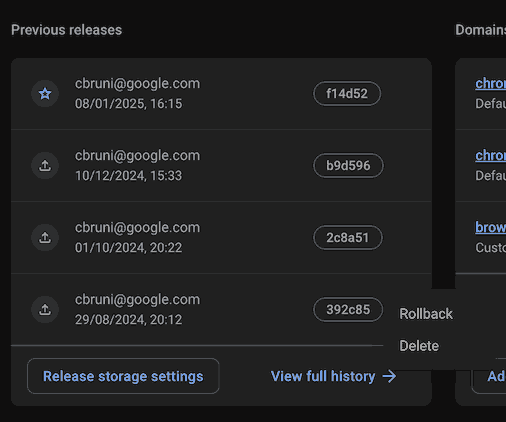

# Chromium Workloads

This is the source for the [chromium workloads page](https://chromium-workloads.web.app/).
We keep copies and versions of common press benchmarks and other statically
hosted workloads here.

Workloads might have custom licenses that can be found in their respective
folders.

It consist of 3 parts:
- The [workloads.json](./public/workloads.json) description file with all
   workloads.
- Workloads (e.g. existing press benchmarks) in the [public](./public) folder.
- The html / javascript code to display the data from workloads.json.

## Workloads

If possible workloads are [DEPS](./DEPS)-rolled from single-version branches.
on forked repositories on <https://chromium.googlesource.com>.

LICENSEs are part of the respective workloads or workload versions.

### Sources
 - Speedometer is pulled DEPS-rolled from a
   [chromium git mirror](https://chromium.googlesource.com/external/github.com/WebKit/Speedometer/).
 - Motionmark versions are manually copied from the
   [github repository](https://github.com/WebKit/Motionmark/).
 - JetStream versions are manually coped from the
   [webkit repository](https://github.com/WebKit/WebKit/tree/main/PerformanceTests/).

## Setup ⚒️
```
mkdir web-workload && cd web-workload;

# Checkout using depot_tools's fetch command:
fetch web-workload;
cd web-workload

# Setup firebase login:
# - Install the firebase cl: https://firebase.google.com/docs/cli#install_the_firebase_cli
# - Setup firebase:
./setup.sh
```

## Deployment 🚀

[chromium-workloads](https://chromium-workloads.web.app) is hosted on
[firebase](https://firebase.google.com/).
- Use [`stage-main.sh`](./stage-main.sh) to stage a testing version for the
  main page on temporary domain (can be used for testing freely)

### Danger Zone 😱
- Use [`deploy-main.sh`](./deploy-main.sh) for the main page on
  <https://chromium-workloads.web.app/>,
- Use [`deploy-subdomains.sh`](./deploy-subdomains.sh) for the
  `chromium-workloads-${INDEX}.web.app>` subdomains.

### Update and Redeployment
- `git pull`
- `gclient sync`
- Testing:
  - `./stage-main.sh`
  - Quickly manually very that main page and benchmark versions load
    correctly.
  - Run the latest tracked benchmark versions.
- Deployment:
  - Deploy using `./deploy-main.sh`
  - Also deploy the subdomain hosting `./deploy-subdomains.sh`

### Emergency Rollback 😰
In case of a broken deployment we can manually restore an old version via the
[firebase console](https://firebase.corp.google.com/u/0/project/chromium-workloads/hosting/sites/chromium-workloads).

- Open the [firebase console](https://firebase.corp.google.com/u/0/project/chromium-workloads)
- Open "Hosting"
- "View" main "chromium-workloads" site
- "Restore" one of the "Previous releases"